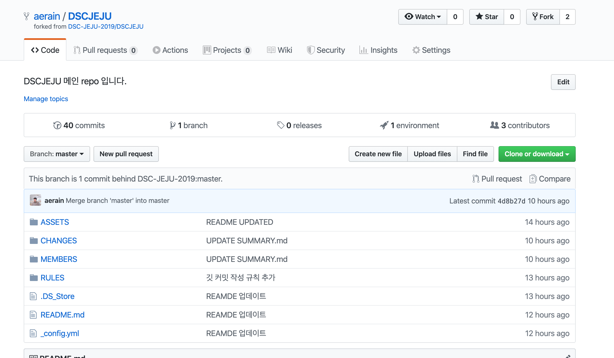

# PULL REQUEST RULE

기본적으로 마스터에 코드를 수정해서 직접 푸쉬하는 행위는 지양하고 있습니다. 

저희는 fork & pr 방식으로 저희 레포지토리에 수정을 하는 방식을 지향합니다.
이로인해 머리가 어지러우신 분들을 위해 방법을 간단히 정리해 드리고자합니다❗️❗️

### 1. fork 진행법 
---
* DSC-2019-JEJU에서 운영하는 레포지토리를 들어가시고 우측 상단에 들어가시면 다음과 같은 그림을 보실 수 있습니다.
{:width="300px" height="300px"}

* Fork를 마치게 되면 자신의 레포지토리로 브랜치가 전환되신 것을 보실 수 있습니다.
{:width="300px" height="300px"}

* 이제 포크한 레포를 클론하는 형태로 로컬에서 작업을 실시하실 수 있습니다. 명령어는 다음과 같습니다.

HTTPS를 사용한 클론
```bash
git clone https://github.com/<username>/<repository-name>.git
```
SSH를 사용한 클론
```bash
git clone git@github.com:<username>/<repository-name>.git
```

* clone을 실시한 뒤에는 원래 레포지토리와 싱크를 맞추기 위해 다음 명령줄을 입력하여 연결합니다.
```bash
# upstream 추가
$ git remote add upstream https://github.com/DSC-JEJU-2019/<repository-name>.git

# 결과 확인 예제 형태
$ git remote -v
origin https://github.com/aerain/DSCJEJU.git (fetch)
origin https://github.com/aerain/DSCJEJU.git (push)
upstream https://github.com/DSC-JEJU-2019/DSCJEJU.git (fetch)
upstream https://github.com/DSC-JEJU-2019/DSCJEJU.git (push)
```

* git remote -v를 입력했을때 다음 형태로 4줄이 올바르게 보여진다면 성공한 것입니다.
* 본래 레포지토리와 싱크를 하기 위해선 다음 구문을 실행합니다.
```bash
$ git fetch upstream
$ git merge upstream/master

or

$ git pull upstream master
```

* 해당 방법으로 에딧을 위한 모든 작업환경 설정은 모두 마쳐지게 됩니다.

### 2. pull request 진행법
